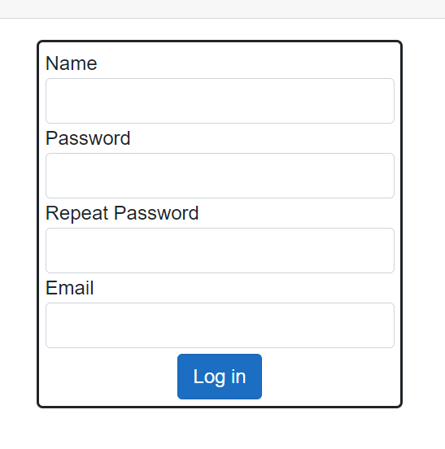
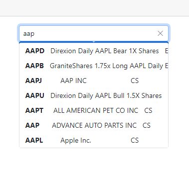
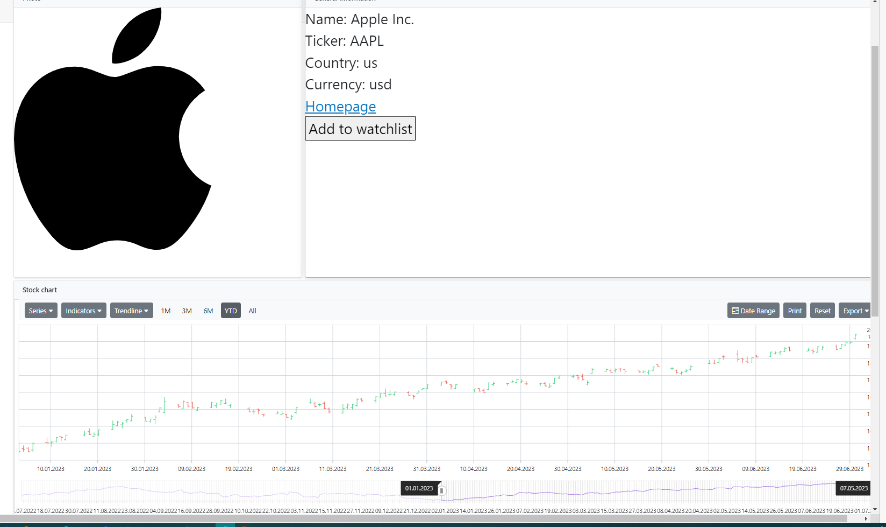
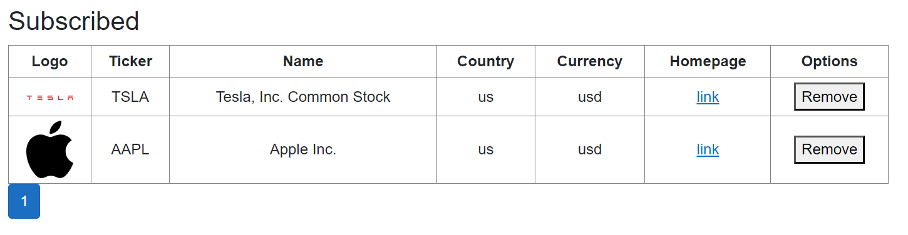

# StockSaver
An app that retrieves information from the Polygon.io API and displays it to the user, while also saving a copy of the data to be shown when the external API is not available. Also supports adding stocks to a user’s watchlist. Only logged in users can use the app.

## Registration

## Searching

## Displaying general information

## Watchlist
Features: sorting, filtering, pagination

